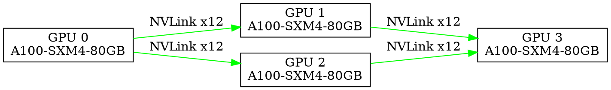

# Topology Visualization

nperf can display GPU topology information showing how GPUs are connected. This is essential for understanding performance characteristics.

## Overview

GPU topology affects collective operation performance. Understanding your topology helps:
- Explain performance results
- Optimize GPU placement
- Debug connectivity issues

## Viewing Topology

### Quick View

```bash
./nperf --topology
```

### With Format

```bash
./nperf --topology --topo-format matrix
./nperf --topology --topo-format tree
./nperf --topology --topo-format dot
./nperf --topology --topo-format json
```

## CLI Options

| Option | Default | Description |
|--------|---------|-------------|
| `--topology` | Disabled | Show topology only (skip benchmark) |
| `--topo-format FMT` | matrix | Output format |
| `--show-transport` | Disabled | Show transport details |

## Output Formats

### Matrix Format (Default)

Shows connectivity between all GPU pairs:

```bash
./nperf --topology --topo-format matrix
```

```
GPU Topology Matrix:

        GPU0    GPU1    GPU2    GPU3    GPU4    GPU5    GPU6    GPU7
GPU0     X      NV12    NV12    NV12    NV12    NV12    NV12    NV12
GPU1    NV12     X      NV12    NV12    NV12    NV12    NV12    NV12
GPU2    NV12    NV12     X      NV12    NV12    NV12    NV12    NV12
GPU3    NV12    NV12    NV12     X      NV12    NV12    NV12    NV12
GPU4    NV12    NV12    NV12    NV12     X      NV12    NV12    NV12
GPU5    NV12    NV12    NV12    NV12    NV12     X      NV12    NV12
GPU6    NV12    NV12    NV12    NV12    NV12    NV12     X      NV12
GPU7    NV12    NV12    NV12    NV12    NV12    NV12    NV12     X

Legend:
  X     = Self
  NVx   = NVLink (x links)
  PIX   = PCIe via switch
  PHB   = PCIe via host bridge
  SYS   = System (cross-socket)
  NODE  = Cross-node
```

### Tree Format

Shows hierarchical topology:

```bash
./nperf --topology --topo-format tree
```

```
GPU Topology Tree:

System
├── Socket 0
│   ├── PCIe Switch 0
│   │   ├── GPU 0: NVIDIA A100-SXM4-80GB
│   │   └── GPU 1: NVIDIA A100-SXM4-80GB
│   └── PCIe Switch 1
│       ├── GPU 2: NVIDIA A100-SXM4-80GB
│       └── GPU 3: NVIDIA A100-SXM4-80GB
└── Socket 1
    ├── PCIe Switch 2
    │   ├── GPU 4: NVIDIA A100-SXM4-80GB
    │   └── GPU 5: NVIDIA A100-SXM4-80GB
    └── PCIe Switch 3
        ├── GPU 6: NVIDIA A100-SXM4-80GB
        └── GPU 7: NVIDIA A100-SXM4-80GB

NVLink Connections:
  GPU0 <--> GPU1: 12 links
  GPU0 <--> GPU2: 12 links
  ...
```

### DOT Format (Graphviz)

Outputs Graphviz DOT format for visualization:

```bash
./nperf --topology --topo-format dot > topology.dot
dot -Tpng topology.dot -o topology.png
```



### JSON Format

Machine-readable topology:

```bash
./nperf --topology --topo-format json
```

```json
{
  "gpus": [
    {
      "id": 0,
      "name": "NVIDIA A100-SXM4-80GB",
      "uuid": "GPU-12345678-1234-1234-1234-123456789abc",
      "memory": 85899345920,
      "computeCapability": "8.0",
      "pciBusId": "0000:07:00.0"
    },
    {
      "id": 1,
      "name": "NVIDIA A100-SXM4-80GB",
      "uuid": "GPU-87654321-4321-4321-4321-cba987654321",
      "memory": 85899345920,
      "computeCapability": "8.0",
      "pciBusId": "0000:0B:00.0"
    }
  ],
  "links": [
    {
      "from": 0,
      "to": 1,
      "type": "NVLink",
      "count": 12,
      "bandwidth": 600
    },
    {
      "from": 0,
      "to": 2,
      "type": "NVLink",
      "count": 12,
      "bandwidth": 600
    }
  ],
  "matrix": [
    ["X", "NV12", "NV12", "NV12"],
    ["NV12", "X", "NV12", "NV12"],
    ["NV12", "NV12", "X", "NV12"],
    ["NV12", "NV12", "NV12", "X"]
  ]
}
```

## Link Types

| Code | Type | Description | Typical Bandwidth |
|------|------|-------------|-------------------|
| NVx | NVLink | Direct NVLink (x links) | 50-600 GB/s |
| PIX | PCIe Switch | Same PCIe switch | 16-32 GB/s |
| PHB | Host Bridge | Same CPU, different switch | 16-32 GB/s |
| PXB | PCIe Bridge | Different PCIe root | 8-16 GB/s |
| SYS | System | Cross-socket QPI/UPI | 10-25 GB/s |
| NODE | Node | Cross-node (network) | 1-100 GB/s |

## NVLink Generations

| Generation | Per-Link BW | Typical Config |
|------------|-------------|----------------|
| NVLink 1.0 | 20 GB/s | P100 |
| NVLink 2.0 | 25 GB/s | V100 |
| NVLink 3.0 | 50 GB/s | A100 |
| NVLink 4.0 | 100 GB/s | H100 |

## Understanding Performance Impact

### Best to Worst Connectivity

1. **NVLink**: Highest bandwidth, lowest latency
2. **PIX/PHB**: PCIe within same root complex
3. **SYS**: Cross-socket, limited by CPU interconnect
4. **NODE**: Cross-node, limited by network

### Example Analysis

```bash
# View topology
./nperf --topology

# Benchmark and correlate
./nperf --op allreduce -b 1G -J -o results.json

# Compare GPUs with NVLink vs PCIe
```

## Transport Information

Show detailed transport info:

```bash
./nperf --topology --show-transport
```

```
Transport Information:

GPU 0 -> GPU 1:
  Type: NVLink
  Links: 12
  P2P: Enabled
  Direct Access: Yes

GPU 0 -> GPU 4:
  Type: PCIe
  Via: Host Bridge
  P2P: Enabled
  Direct Access: Via CPU
```

## Multi-Node Topology

For multi-node setups:

```bash
# MPI mode
mpirun -np 8 ./nperf --mpi --topology

# Socket mode
./nperf -s -n 3 --topology
```

Multi-node output shows:
- Per-node GPU topology
- Cross-node connectivity (InfiniBand, Ethernet)
- NCCL transport selection

## Exporting for Documentation

### PNG Image

```bash
./nperf --topology --topo-format dot > topo.dot
dot -Tpng topo.dot -o topology.png
```

### SVG (Scalable)

```bash
./nperf --topology --topo-format dot > topo.dot
dot -Tsvg topo.dot -o topology.svg
```

### PDF

```bash
./nperf --topology --topo-format dot > topo.dot
dot -Tpdf topo.dot -o topology.pdf
```

## Troubleshooting Topology

### No NVLink Detected

```bash
# Check NVIDIA driver
nvidia-smi nvlink -s

# Verify P2P access
nvidia-smi topo -m
```

### Unexpected PCIe Topology

```bash
# Compare with nvidia-smi
nvidia-smi topo -m

# Check NUMA
numactl --hardware
```

### P2P Disabled

```bash
# Enable P2P
export CUDA_VISIBLE_DEVICES=0,1
export CUDA_DEVICE_ORDER=PCI_BUS_ID

# Check P2P support
nvidia-smi -q | grep P2P
```

## Best Practices

1. **Document topology**: Save topology output for reference
2. **Correlate with performance**: Understand why some GPU pairs are faster
3. **Place workloads wisely**: Keep communicating GPUs close
4. **Monitor changes**: Verify topology after hardware changes

## Example: Full Topology Report

```bash
#!/bin/bash
# generate_topology_report.sh

HOST=$(hostname)
DATE=$(date +%Y%m%d)

echo "Generating topology report for $HOST..."

# Matrix view
./nperf --topology --topo-format matrix > "topology_${HOST}_${DATE}_matrix.txt"

# JSON for processing
./nperf --topology --topo-format json > "topology_${HOST}_${DATE}.json"

# DOT for visualization
./nperf --topology --topo-format dot > "topology_${HOST}_${DATE}.dot"
dot -Tpng "topology_${HOST}_${DATE}.dot" -o "topology_${HOST}_${DATE}.png"

echo "Report generated:"
ls -la topology_${HOST}_${DATE}*
```

## See Also

- [Output Formats](formats.md)
- [Performance Tuning](../advanced/performance-tuning.md)
- [Troubleshooting](../advanced/troubleshooting.md)
